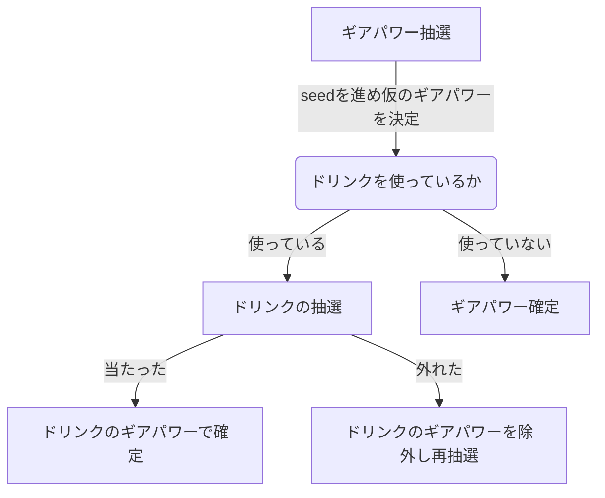

# gearseed
Splatoon3 gear seed with python

```mermaid
graph 
    A[ギアパワー抽選] -->|seedを進め仮のギアパワーを決定| B(ドリンクを使っているか)
    B -->|使っている| C[ドリンクの抽選]
    B -->|使っていない| D[ギアパワー確定]
    C -->|当たった| E[ドリンクのギアパワーで確定]
    C -->|外れた| F[ドリンクのギアパワーを除外し再抽選]
```
